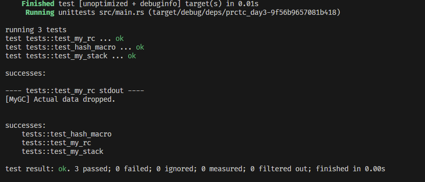

# Day3 CloudWeGo Practice 

## 测试

`cargo test -- --show-output` 以获取stdout的输出验证MyRc的资源释放。

### 结果截图

## 关于Unsafe的使用

所有提供内部可变性的标准库组件都是基于UnsafeCell；UnsafeCell是实质上唯一的内部可变性来源。  
但在此使用UnsafeCell唯一的正面用处是绕过对裸指针的限制，并且对内存手动gc时必须取出裸指针操作，并没有实际意义，所以并未采用。  
因此我们需要使用unsafe：因为这样的内存访问要求天然违反了所有权系统。  
IMO **根本原因在于，生命周期和所有权系统在编译期完成检查，在safe模式下不可能根据一个运行时才能确定的值（如ref count）决定资源的分配、析构。**
既然需要手动的内存管理，则不使用裸指针这一要求似乎有些舍近求远。尽管如此，我们仍可以使用NonNull绕过这一限制（本质上只是一层rename）。    
尽管RefCell看起来可以满足要求，但遗憾的是，并不能从`Ref<'_, T>`转为`&T`（需要维护相关信息以进行运行时所有权检查），因此Deref trait无法满足。

## 广告

个人博客-从偏序关系和泛型系统的角度理解生命周期：[https://cubicy.icu/2023/09/05/rust-lifetime/](https://cubicy.icu/2023/09/05/rust-lifetime/)